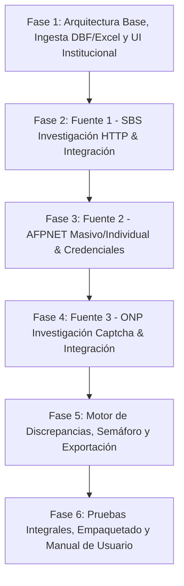

# PLAN MAESTRO DE DESARROLLO: SISTEMA DE VERIFICACIÓN DE PENSIONES (MPFN)

> **Ubicación:** `d:\MPFN\PROYECTOS\verificacion_sistema_pension\docs\PLAN_DESARROLLO_SISTEMA_PENSIONES.md`  
> **Institución:** Ministerio Público - Fiscalía de la Nación (MPFN)  
> **Objetivo:** Automatizar y asegurar la correcta verificación del sistema de pensiones (SPP - AFP / SNP - ONP) del personal institucional a partir de los reportes del SIGA para garantizar el pago oportuno y exacto a las entidades correspondientes.

---

## 1. RESUMEN EJECUTIVO Y DIAGNÓSTICO TÉCNICO

Tras analizar el entorno de ejecución y los archivos fuente provistos en `docs/`:

1. **Datos de Entrada (SIGA):**
   - El archivo `altas cas set 2026.DBF` se puede leer **directamente en Python** sin requerir conversión manual a Excel. Contiene exactamente los campos requeridos:
     - `DNI`, `APE_PAT`, `APE_MAT`, `NOM_EMP` (descomponible en primer y segundo nombre).
     - `NACIM` (fecha de nacimiento en formato `YYYYMMDD`, requerida por ONP).
     - `PREVISIONA`, `AFILIACION`, `CUSPP` (datos actuales en SIGA para contrastar discrepancias).
   - El sistema soportará tanto **.DBF** nativo como **.xlsx**, **.xls** y **.csv**.

2. **Orden de Implementación de Fuentes de Validación:**
   - **Fase 2 (Prioridad 1): SBS (Pública, sin credenciales, sin captcha, individual)**. Permite conocer de inmediato si el trabajador está en el Sistema Privado (AFP Prima, Integra, Profuturo, Habitat) o si no figura en el SPP.
   - **Fase 3 (Prioridad 2): AFPNET (Con credenciales institucionales, con captcha, soporta masivo y consultas individuales)**. Permite la validación global, confirmación de SNP/AFP y cotejo de devengues y comisiones.
   - **Fase 4 (Prioridad 3): ONP (Pública, con captcha, desactualizada)**. Se implementa al final como fuente complementaria/histórica para casos dudosos no resueltos por SBS/AFPNET.

3. **Estrategia de Reducción de Automatización de UI (Headless / API First):**
   - **SBS:** Se investigará el endpoint HTTP POST del formulario ASP.NET (`Afil_Consulta.aspx`) extrayendo `__VIEWSTATE` y `__EVENTVALIDATION` mediante peticiones directas (`requests`/`primp`), reduciendo el tiempo por consulta de 4 segundos a menos de 0.4 segundos sin abrir navegador.
   - **AFPNET:** Al soportar **Carga Masiva Excel** (`Consulta_CUSPP_Masiva_Ejemplo.xls`), en lugar de navegar y resolver un captcha por cada trabajador (133+ llamadas UI), el sistema generará automáticamente la plantilla Excel exacta con un clic y subirá el archivo en un único flujo UI/sesión con 1 solo captcha, procesando todos los trabajadores en segundos.
   - **ONP:** Se interceptará el endpoint que genera la imagen de captcha y el endpoint AJAX de consulta para evitar renderizar el DOM completo. Para el captcha, se investigará preprocesamiento con OpenCV + OCR local gratuito, con fallback a ingreso asistido o Playwright.

4. **Diseño Visual y Experiencia:**
   - Interfaz web local moderna, limpia y sobria basada en el Manual de Identidad Visual del **Ministerio Público - Fiscalía de la Nación / Gob.pe** (Azul marino institucional `#0B2F64`, Guinda institucional `#8B0000`, tarjetas de resumen, estados de semáforo y filtros interactivos).

---

## 2. ESTRUCTURA POR FASES DE IMPLEMENTACIÓN

---

### FASE 1: ARQUITECTURA BASE, INGESTA DE ARCHIVOS (DBF/EXCEL) Y UI INSTITUCIONAL

#### Objetivo
Construir la aplicación web local, el servidor backend y el módulo de ingesta de datos que permita cargar archivos `.DBF` (SIGA), `.xlsx` o `.csv`, mapear automáticamente sus columnas y visualizarlos en una tabla interactiva previa a la consulta.

#### Pasos de Ejecución
1. **Configuración del Servidor Web Local:**
   - Crear servidor ligero en Python (usando el entorno ya existente con `requests`, `pandas`, `jinja2`/`http.server` o `Flask`).
   - Configurar punto de entrada local accesible desde `http://localhost:5000` o `http://localhost:8000`.
2. **Módulo de Ingesta Inteligente (`file_parser`):**
   - Lector nativo para archivos `.DBF` del SIGA (`altas cas set 2026.DBF`).
   - Normalizador de campos:
     - DNI (8 dígitos).
     - Nombre completo, Apellido Paterno (`APE_PAT`), Apellido Materno (`APE_MAT`), Nombres (`NOM_EMP`).
     - Separación inteligente de primer y segundo nombre si `NOM_EMP` contiene ambos.
     - Fecha de Nacimiento (`NACIM` en formato `YYYYMMDD` convertido a `DD/MM/YYYY`).
     - Datos previos del SIGA (`PREVISIONA`, `AFILIACION`, `CUSPP`).
   - Soporte para subida de archivos `.xlsx` y `.csv` con detector automático de nombres de columnas sin importar variaciones.
3. **Frontend con Sistema de Diseño MPFN:**
   - Cabecera con logo y colores institucionales del Ministerio Público (Azul `#0B2F64` / Guinda `#8B0000`).
   - Zona de arrastre de archivos (*Drag & Drop*).
   - Selector de fuentes de validación activas mediante switches (SBS premarcado por defecto, ONP, AFPNET).
   - Tabla previa con paginación, búsqueda por DNI o nombre, y selector de columnas visibles.
4. **Validación de Fase:**
   - Cargar el archivo real `docs/altas cas set 2026.DBF` y verificar que los 133 trabajadores se listen con sus datos completos y formateados.

---

### FASE 2: PRIMERA FUENTE DE VALIDACIÓN - SBS (SUPERINTENDENCIA DE BANCA Y SEGUROS)

#### Objetivo
Implementar la consulta individual automatizada para todos los trabajadores contra el portal de la SBS (`https://servicios.sbs.gob.pe/ReporteSituacionPrevisional/Afil_Consulta.aspx`), priorizando la reducción de uso de UI.

#### Paso 2.1: Investigación de Reducción de Automatización UI (HTTP Directo vs Navegador)
1. **Inspección de Tráfico de Red:**
   - Analizar el flujo de la página ASP.NET:
     - Petición inicial `GET /ReporteSituacionPrevisional/Afil_Consulta.aspx` para extraer `__VIEWSTATE`, `__VIEWSTATEGENERATOR` y `__EVENTVALIDATION`.
     - Petición `POST` con los parámetros:
       - `ddlTipoDocumento`: 0 (DNI)
       - `txtNumeroDocumento`: DNI
       - `txtPaterno`: Apellido paterno
       - `txtMaterno`: Apellido materno
       - `txtPrimerNombre`: Primer nombre
       - `txtSegundoNombre`: Segundo nombre (opcional o si existe)
   - Realizar script de prueba (`research_sbs_http.py`) para confirmar si la SBS responde directamente con el HTML que contiene la tabla o el texto en rojo *"No se encontraron resultados"*.
2. **Evaluación de Ventajas:**
   - Si HTTP directo funciona: consultas en <0.5 segundos por persona, sin abrir ventanas de navegador, consumo mínimo de CPU.
   - Si requiere JS o cookies dinámicas: utilizar `playwright` en modo `headless=True`, optimizando el bloqueo de recursos estáticos (imágenes pesadas, css externos, analytics) para máxima velocidad.

#### Paso 2.2: Implementación del Conector SBS
1. Crear el conector `sbs_service.py` con reintentos automáticos ante cortes de red.
2. Parser de respuesta:
   - Extraer si está afiliado al SPP.
   - Extraer AFP de afiliación (Profuturo, Integra, Prima, Habitat).
   - Extraer Código CUSPP y Fecha de Afiliación.
   - Si devuelve *"No se encontraron resultados"*, clasificar como *"NO REGISTRADO EN SPP (Pendiente ONP / No Afiliado)"*.
3. **Flujo de Ejecución en Lote con Barra de Progreso:**
   - Control de velocidad / tasa de peticiones para no ser bloqueado por la SBS (delay prudente de 0.5 a 1.5s entre consultas).
   - Progreso en tiempo real en la UI mediante Server-Sent Events (SSE) o WebSockets (X de 133 completados).
   - Botón de Pausar / Reanudar / Cancelar.

---

### FASE 3: SEGUNDA FUENTE DE VALIDACIÓN - AFPNET (CONSULTA MASIVA E INDIVIDUAL)

#### Objetivo
Integrar la verificación con la plataforma de AFPNET (`https://www.afpnet.com.pe/Empleador/IniciarSesion`) utilizando las credenciales institucionales provistas.

#### Paso 3.1: Investigación y Comparación de Modos (Masivo vs Individual)
1. **Modo Consulta Masiva (Recomendado - 99% Reducción de UI):**
   - A partir del archivo de ejemplo analizado (`Consulta_CUSPP_Masiva_Ejemplo.xls`), el sistema generará automáticamente el archivo de carga con los datos de los trabajadores (`Tipo Doc = 0`, `N° Doc`, `Apellido Paterno`, `Apellido Materno`, `Nombres`).
   - Flujo de automatización:
     1. Inicio de sesión en AFPNET con RUC `20131370301`, Usuario `EMP0052`, Contraseña `Mpfn123*`.
     2. Resolución del captcha de login (caracteres sin distorsión severa, fácil de automatizar con OCR o entrada única asistida).
     3. Navegación a *Consultas y Reportes -> Consulta Masiva de CUSPP*.
     4. Subida del archivo Excel generado y descarga del resultado (`res_prueba_1_consultaCUSPPMasiva.xlsx`).
     5. Cruce automático de datos con la tabla principal.
2. **Modo Consulta Individual (Fallback):**
   - Para consultas puntuales de 1 o 2 trabajadores sin regenerar el archivo masivo.

#### Paso 3.2: Implementación del Conector AFPNET
1. Generador de plantilla Excel compatible con AFPNET.
2. Módulo de automatización con Playwright para sesión y descarga de reportes.
3. Lector del reporte de salida de AFPNET:
   - Extracción de `PREVISIONA` / `AFP` (`SNP` para ONP, nombre de AFP, o vacío para no afiliado).
   - Tipo de comisión (`MIXTA` / `FLUJO`), % de comisión, devengue máximo y último devengue.

---

### FASE 4: TERCERA FUENTE DE VALIDACIÓN - ONP (OFICINA DE NORMALIZACIÓN PREVISIONAL)

#### Objetivo
Integrar la consulta a la plataforma de Consulta Libre de Afiliados de la ONP (`https://tuzonasegura.onp.gob.pe/ConsultaLibreAfiliado/`) como fuente complementaria/histórica para los trabajadores que figuren con dudas tras SBS y AFPNET.

#### Paso 4.1: Investigación de Reducción de Automatización UI e Intercepción de Captcha
1. **Inspección Técnica de la ONP:**
   - Identificar cómo se genera el captcha: URL del endpoint de imagen (ej. `/Captcha.aspx` o `/GenerarCaptcha`), headers y cookies de sesión (`ASP.NET_SessionId`).
   - Identificar el método de envío del formulario: campos requeridos (Tipo Doc, Nro Doc, Fecha Nacimiento `DD/MM/YYYY`, texto Captcha).
2. **Investigación de Resolución Gratuita del Captcha:**
   - **Opción A (OCR Local Gratuito):**
     - Script de prueba con OpenCV (umbralización Otsu, eliminación de ruido/líneas, dilatación morfológica) + OCR.
     - Evaluar tasa de acierto. Si el captcha es legible por OCR preprocesado, resolución 100% autónoma.
   - **Opción B (Playwright con Intercepción y Asistencia):**
     - Si la distorsión del captcha supera la precisión del OCR, Playwright extrae el recorte del captcha y la UI del sistema muestra un diálogo rápido al operador para digitar los 4-5 caracteres, o resuelve el lote con rotación de sesión.
   - **Opción C (Estrategia de Optimización de Consultas):**
     - **Regla de negocio inteligente:** Consultar a ONP **únicamente** a los trabajadores para los cuales ni la SBS ni AFPNET hayan devuelto afiliación clara. Esto reduce las consultas a un número mínimo de casos, reduciendo el impacto de su desactualización y evitando la interacción innecesaria con captchas.

#### Paso 4.2: Implementación del Conector ONP
1. Crear el conector `onp_service.py` integrando la fecha de nacimiento extraída del campo `NACIM` del DBF/Excel.
2. Detección del estado de respuesta:
   - Detección del mensaje *"Actualmente te encuentras afiliado al SNP"*.
   - Extracción de la fecha de última actualización del dato.
   - Detección de no afiliación (la página permanece sin cambios o mensaje de no registrado).
3. Actualización en tiempo real de la tabla de resultados.

---

### FASE 5: MOTOR DE DISCREPANCIAS, SEMÁFORO Y REPORTE EXPORTABLE

#### Objetivo
Consolidar la información de las fuentes consultadas, contrastarlas contra el dato registrado en el SIGA y presentar una vista analítica clara para la toma de decisiones de pago.

#### Pasos de Ejecución
1. **Motor de Reglas de Negocio y Semáforo:**
   - **Verde (Coincidencia Plena):**
     - El dato del SIGA coincide exactamente con la fuente consultada (ej: SIGA = `PROFUTURO` y SBS/AFPNET = `PROFUTURO`).
   - **Rojo / Naranja (Discrepancia que exige corrección en SIGA):**
     - Ejemplo: SIGA tiene registrado `ONP`, pero SBS confirma que está afiliado a `PRIMA AFP`.
     - Ejemplo: SIGA tiene registrado `INTEGRA`, pero AFPNET y SBS reportan `HABITAT`.
     - Permite alertar antes de devengar el pago a la entidad equivocada.
   - **Azul (Informativo / Sin Afiliación):**
     - El trabajador no figura en SBS ni en ONP (no afiliado o trámite pendiente de primera afiliación).
2. **Personalización del Reporte:**
   - Selector de columnas visibles (DNI, Nombres, Fuente SIGA, Fuente SBS, Fuente ONP, Fuente AFPNET, CUSPP, Tipo Comisión, Estado Semáforo, Observaciones).
   - Filtros rápidos: "Ver solo discrepancias", "Ver no afiliados", "Ver coincidentes".
3. **Exportación de Resultados:**
   - Exportación a **Excel (.xlsx)** con formato oficial MPFN y estilos condicionales en celdas (colores verde, naranja, rojo).
   - Exportación a **CSV** para retroalimentación rápida o carga a sistemas auxiliares.

---

### FASE 6: PRUEBAS INTEGRALES, OPTIMIZACIÓN Y GUÍA DE USUARIO

#### Objetivo
Validar la resiliencia del sistema completo, garantizar que funcione localmente de manera autónoma y documentar la operación.

#### Pasos de Ejecución
1. Prueba end-to-end con el archivo real `altas cas set 2026.DBF`.
2. Manejo de contingencias (caídas de portales gubernamentales, timeouts, reintentos).
3. Creación del script ejecutable de inicio rápido (`iniciar_sistema.bat`) para que cualquier usuario en MPFN pueda levantarlo con doble clic.
4. Elaboración del manual de usuario con capturas de pantalla y guía de resolución de discrepancias.

---

## 3. RESUMEN DE FASES PARA LA EJECUCIÓN CON LA IA

Para trabajar paso a paso de forma ordenada, en cada conversación el usuario solo necesitará indicar la fase activa:

| Fase | Título | Insumos Requeridos del Usuario | Entregable Principal |
|---|---|---|---|
| **Fase 1** | Arquitectura Base, Ingesta DBF/Excel y UI MPFN | Ninguno extra (se usará `altas cas set 2026.DBF`) | Web local con carga de DBF/Excel y visualización en tabla MPFN |
| **Fase 2** | Conector SBS (Investigación HTTP + Integración) | Ninguno extra (portal público) | Consulta masiva/individual a SBS con progreso en vivo |
| **Fase 3** | Conector AFPNET (Carga Masiva Excel + Credenciales) | Record o validación del flujo web de carga masiva | Carga y descarga automática masiva en AFPNET |
| **Fase 4** | Conector ONP (Investigación Captcha + Integración) | Ninguno o confirmación de consulta de casos pendientes | Consulta complementaria a ONP con OCR/asistencia |
| **Fase 5** | Motor de Discrepancias, Semáforo y Exportación | Criterios adicionales de alertas si los hubiera | Reporte comparativo con semáforo y exportador Excel |
| **Fase 6** | Empaquetado, Launcher `.bat` y Documentación Final | Pruebas finales en la máquina | Sistema 100% operativo con ejecutable local |

