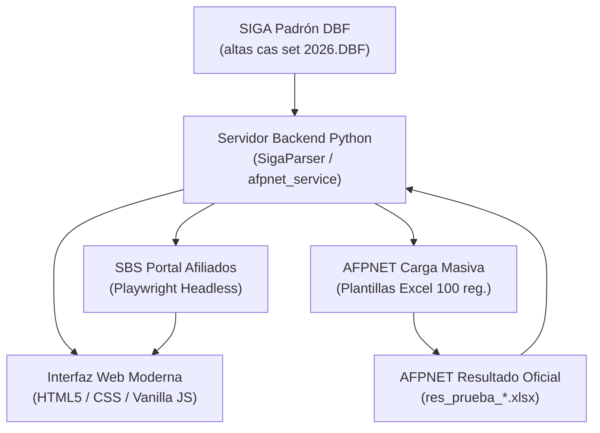

# Documentación del Sistema de Verificación Previsional - MPFN

Bienvenido al directorio de documentación técnica y funcional del **Sistema de Verificación Previsional y Consulta de Situación Previsional (SBS / AFPNET)** para el **Ministerio Público - Fiscalía de la Nación**.

---

## 📁 Contenido del Directorio

| Recurso / Archivo | Descripción |
| :--- | :--- |
| [`PLAN_DESARROLLO_SISTEMA_PENSIONES.md`](./PLAN_DESARROLLO_SISTEMA_PENSIONES.md) | Documento maestro con la arquitectura técnica, plan de desarrollo, flujos de integración (SBS y AFPNET), estructura de datos y fases completadas del sistema. |
| [`archivos_pruebas/`](./archivos_pruebas/) | Directorio de muestras oficiales y archivos de prueba (nóminas DBF del SIGA, plantillas base Excel de AFPNET y respuestas oficiales descargadas). |

---

## 🏛️ Resumen de la Arquitectura del Sistema

El sistema automatiza la verificación y acreditación del régimen pensionario (SPP vs. SNP) para el personal de la institución:

1. **Ingesta de Nómina:** Lectura nativa de archivos DBF generados por el SIGA institucional sin requerir drivers externos de Visual FoxPro.
2. **Cruce Masivo AFPNET:** Segmentación automática en lotes de hasta 100 registros con generación de archivos compatibles con el formato Excel XML de AFPNET, y carga de resultados descargados para cruzar masivamente CUSPP, AFP, Tipo de Comisión y Devengues.
3. **Consulta SBS Individual / Automatizada:** Automatización con Playwright para la resolución de consultas directas en el portal público de la SBS.
4. **Exportación Consolidada:** Generación de reportes Excel / CSV listos para auditoría y planillas.

---

## 🧪 Archivos de Prueba

Para revisar el detalle de las muestras y archivos de prueba disponibles para desarrollo y validación, consulte:
👉 **[`docs/archivos_pruebas/README.md`](./archivos_pruebas/README.md)**
